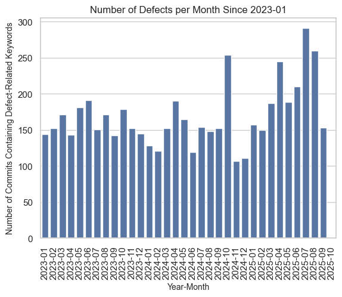
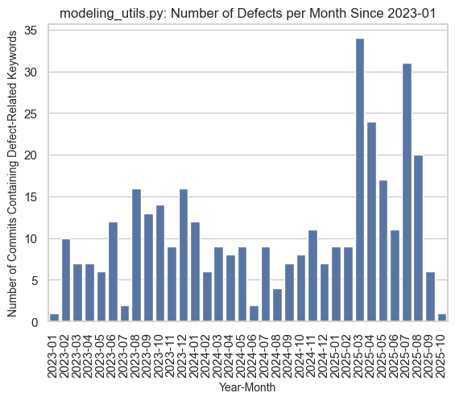
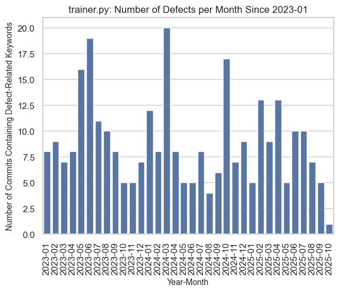
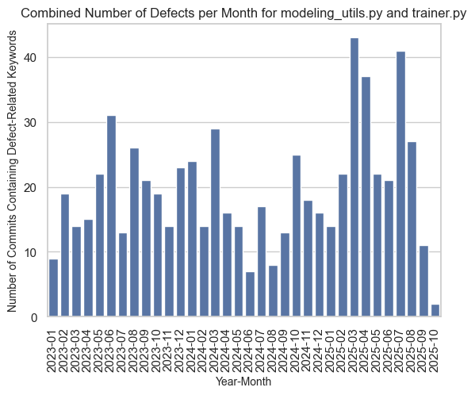
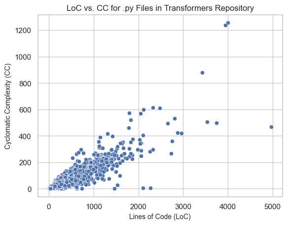
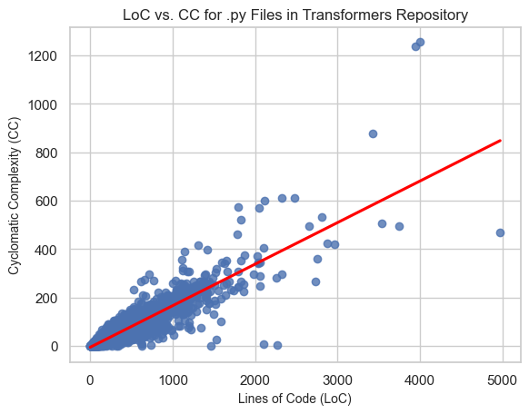
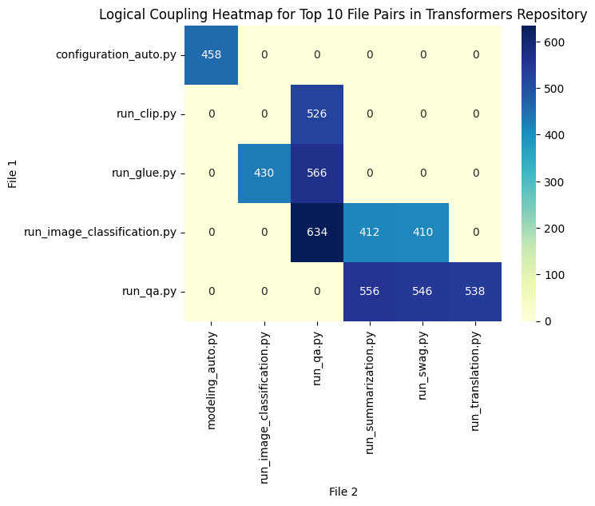
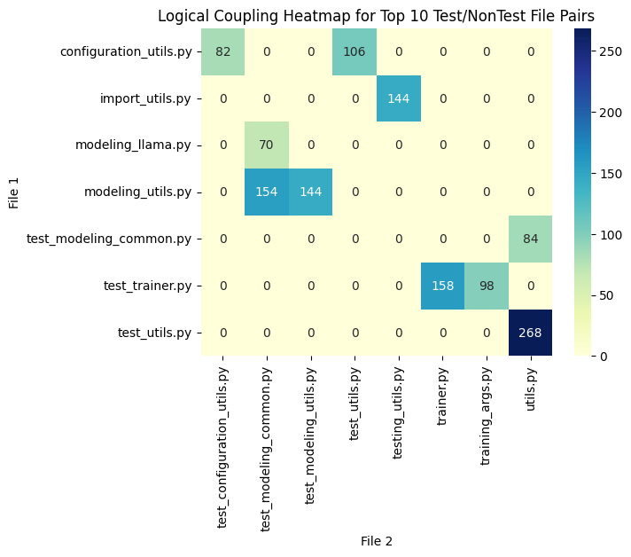

# fss-group-dorech-FSS_SE_Sheet_1

## Prerequisites
### Setting up the assignment environment
* Cloning the HuggingFace Transformers repo & checking out release tag v4.57.0: <br>
    From inside the assignment repo, the following was run in the terminal:
    ```
    git clone https://github.com/huggingface/transformers.git
    cd transformers
    git checkout v4.57.0
    ```
* Creating a Python virtual environment: <br>
    To create a virtual environment using Python 3.12, each team member must run the following command in the root of the repo once (the .gitginore file ensures that the environment isn't pushed to github):
    ```
    python3.12 -m venv .venv
    ```
    Then, to active the virtual environment:
    ```
    (macOS/linux)   source .venv/bin/activate
    (PowerShell)    .\.venv\Scripts\Activate
    ```
    Any packages that are installed while the virtual environment is activated will be installed inside the environment and must be manually added to the ```requirements.txt```.<br>

    To install packages from the ```requirements.txt``` file, run the followng while the virtual environment is activated:
    ```
    pip install -r requirements.txt
    ```
    To deactivate the virtual environment, run:
    ```
    deactivate
    ```

```python
import pydriller, datetime, re, pandas as pd, seaborn as sns, json, numpy as np
from tqdm import tqdm
```

## Task 1: Defect Analysis
Defective hotspots are files where defects are frequently found. We will implement a simple yet effective approach to identify these hotspots by analyzing commit messages for keywords that indicate defect resolutions, such as “fix”, “bug”, “error”, or “issue”. To complete this task, follow the steps described below.

1) <b>Use Git to extract all the commit messages after 2023-01-01. The cutoff date is chosen for computational reasons and will be used for the rest of the tasks as well.
2) Analyze these messages to detect the presence of specific keywords of your choice related to defect fixes.</b>


```python
cnt = 0
data = []
for commit in pydriller.Repository('transformers/').traverse_commits():
    if commit.author_date.date() >= datetime.date(2023, 1, 1): # enforcing cut off date
        if re.search(r'(fix|bug|error|issue)', commit.msg, re.IGNORECASE): # filtering for presence of defect-related keywords
            data.append({'hash': commit.hash, 'author_date': commit.author_date.date(), 'year_month': commit.author_date.date().strftime('%Y-%m')})
            cnt += 1
            print('hash {}, author date {}'.format(commit.hash, commit.author_date.date()))
df = pd.DataFrame(data)
print(f'Iterated over {cnt} commits total.')
print(data)
```

    hash a3e8d3cb1c0ce87c4e5858ab1c69ea92db360d47, author date 2023-01-03
    hash 367fdf3330121a075c06d796bb95dfb1c69c65e4, author date 2023-01-03
    hash 305f41e4dea99d9fdc212287263b3748aacc63d3, author date 2023-01-03
    ... (output truncated)


3) <b>Calculate and plot the total number of defects per month. Why do you think the number of defects dropped sharply in October 2025?</b>


```python
sns.set_theme(style="whitegrid")
ax = sns.countplot(x=df.sort_values('year_month')['year_month'])
ax.tick_params(axis='x', rotation=90)
ax.set_title('Number of Defects per Month Since 2023-01')
ax.set_xlabel('Year-Month', fontsize=10)
ax.set_ylabel('Number of Commits Containing Defect-Related Keywords', fontsize=10)
```


    Text(0, 0.5, 'Number of Commits Containing Defect-Related Keywords')


    

    


<b>Why do you think the number of defects dropped sharply in October 2025?</b><br>
The plot above shows the number of commits since 2023-01 that contained the keywords "bug", "fix", "error" or "issue" per month. The task was to plot the number of defects per month, which is not technically what we are showing here. Instead, commits containing defect-related keywords usually imply that the referenced defect has been fixed as of the given commit, so it is more precise to say that this plot shows the approximate number of fixes made per month.

Evidently, there is a sharp decline of commits containing defect-related keywords in October 2025. This can be traced back to the overall low number of commits in this month (only 2).

4) <b>Calculate and plot the number of defects per month for the two files with the highest number of defects.</b>


```python
cnt = 0
data = []
for commit in pydriller.Repository('transformers/').traverse_commits():
    if commit.author_date.date() >= datetime.date(2023, 1, 1):
        if re.search(r'(fix|bug|error|issue)', commit.msg, re.IGNORECASE):
            # adding modified files to the data collected about extracted commits to be able to identify the two files with the highest number of defects later on
            data.append({'hash': commit.hash, 'author_date': commit.author_date.date(), 'year_month': commit.author_date.date().strftime('%Y-%m'), 'modified_files': commit.modified_files})
            cnt += 1
            print('hash {}, author date {}'.format(commit.hash, commit.author_date.date()))
df = pd.DataFrame(data)
print(f'Iterated over {cnt} commits total.')
df.tail(10)
```

    hash a3e8d3cb1c0ce87c4e5858ab1c69ea92db360d47, author date 2023-01-03
    hash 367fdf3330121a075c06d796bb95dfb1c69c65e4, author date 2023-01-03
    hash 305f41e4dea99d9fdc212287263b3748aacc63d3, author date 2023-01-03
    ... (output truncated)


```python
with open('data.txt', 'w') as f:
    f.write(str(data))
```


```python
# identify the files with the highest number of defects
files = {}
for entry in tqdm(data):
    for file in entry['modified_files']:
        filename = file.filename
        if filename not in files:
            files[filename] = 0
        files[filename] += 1

print("Top 5 modified files:")
top_5_files = sorted(files.items(), key=lambda x: x[1], reverse=True)[:5]
for file, count in top_5_files:
    print(f"{file}: {count} modifications")
```


    Top 2 modified files:
    __init__.py: 1438 modifications
    _toctree.yml: 483 modifications
    modeling_utils.py: 367 modifications
    trainer.py: 300 modifications
    modeling_auto.py: 259 modifications


    


Unsurprisingly, the two files with the greatest number of commits containing defect-related keywords are two configuration files, ```__init.py__``` and ```_toctree.yml```. This is unsurprising, because configuration files are highly coupled with other "normal" files, since configurations often need to changed or updated when changing the source code. 

As was discussed in the lecture, we will omit these two files in our analysis to follow, since changes to configuation files don't indicate problems with these files in the way that frequent changes to a source code file might. As such, we identify the following two files as the ones with the greatest number of commits containing defect-related keywords:
* ```modeling_utils.py```: 367 commits containing defect-related keywords since 2023-01.
* ```trainer.py```: 300 commits containing defect-related keywords since 2023-01.


```python
# plotting the number of defects per month for the two files with the highest number of defects
file_1_data = []
file_2_data = []
file_combined_data = []
file_1 = "modeling_utils.py"
file_2 = "trainer.py"
for entry in tqdm(data):
    for f in entry['modified_files']:
        if f.filename == file_1:
            file_1_data.append(entry)
        if f.filename == file_2:
            file_2_data.append(entry)
        if f.filename == file_1 or f.filename == file_2:
            file_combined_data.append(entry)
```


```python
df_file_1 = pd.DataFrame(file_1_data)
sns.set_theme(style="whitegrid")
ax = sns.countplot(x=df_file_1.sort_values('year_month')['year_month'])
ax.tick_params(axis='x', rotation=90)
ax.set_title('modeling_utils.py: Number of Defects per Month Since 2023-01')
ax.set_xlabel('Year-Month', fontsize=10)
ax.set_ylabel('Number of Commits Containing Defect-Related Keywords', fontsize=10)
```


    

    


```python
df_file_2 = pd.DataFrame(file_2_data)
sns.set_theme(style="whitegrid")
ax = sns.countplot(x=df_file_2.sort_values('year_month')['year_month'])
ax.tick_params(axis='x', rotation=90)
ax.set_title('trainer.py: Number of Defects per Month Since 2023-01')
ax.set_xlabel('Year-Month', fontsize=10)
ax.set_ylabel('Number of Commits Containing Defect-Related Keywords', fontsize=10)
```


    

    


```python
df_combined = pd.DataFrame(file_combined_data)
sns.set_theme(style="whitegrid")
ax = sns.countplot(x=df_combined.sort_values('year_month')['year_month'])
ax.tick_params(axis='x', rotation=90)
ax.set_title('Combined Number of Defects per Month for modeling_utils.py and trainer.py')
ax.set_xlabel('Year-Month', fontsize=10)
ax.set_ylabel('Number of Commits Containing Defect-Related Keywords', fontsize=10)
```


    

    


<b>In which month were the most defects introduced?</b> <br>
The month with the greatest number of commits containing defect-related keywords across both files (```modeling_utils.py``` and ```trainer.py```) is March 2025, with 40+ commits. 

When considering the two files inidividually, ```modeling_utils.py``` had the most commits containing defect-related keywords in March 2025, while ```trainer.py``` had the most commits containing defect-related keywords in March 2024.
  
<b>How would you explain it? Manually examine the repository for that month (e.g., change logs, releases, commit messages) and come up with a hypothesis.</b><br>
We didnt find a specific reason why in March 2025 the most commits with defects were introduced.


5) <b>What are the limitations of this method for finding defective hotspots?</b>
Some limitations of this method for finding defective hotspots include:
* This method makes the following assumption: 1 commit containing a defect-related keyword = 1 fix. However, developers do not always follow the best practices for commits. In other words, sometimes, a single commit will include fixes for multiple issues. With the method we have applied here, this commit would only be counted once (since the regular expression can't count the occurrences of matches), even though it should technically be counted multiple times. For example, consider ```commit a40f1ax``` made in March 2025 concerning ```modeling_utils.py```:
    ```
    Fix couples of issues from #36335 (#36453)
    * fix
    * style
    * better allocation
    * fix
    * fix
    * style
    * revert disk
    * exit
    * style
    * return if nothing to cache
    * dtensor guard
    * fix regressiion
    * fix regression
    * fix
    * fix
    ```
    This commit includes multiple fixes, even though our method only counts it once. 
* Another limitation of this method is the fact that all fixes are considered equal. In reality, certain fixes might indicate more serious or complex problems than others.  

## Task 2: Complexity Analysis
<b>Measuring complexity is useful in many cases, like pinpointing refactoring opportunities, and a number of different metrics exist for this task, which are shown in Table 1. A complexity hotspot is a file that might be problematic due to its high complexity. With that in mind, complete the following analysis:</b>

1) <b>Select two complexity metrics of your choice.</b><br>
We have chosen to consider the following two metrics:
    * Lines of code (LoC)
    * Cyclomatic complexity (CC)

2) <b>Calculate the complexity of all .py files in the repository using the selected metrics.</b>


```python
py_files = {}
for commit in tqdm(data):
    for modified_file in commit["modified_files"]:
        filename = modified_file.filename
        if filename.endswith(".py"):
            loc = modified_file.nloc
            cc = modified_file.complexity
            py_files[filename] = {"loc": loc, "cc": cc}

```


```python
with open("complexity_metrics.json", "w") as f:
    json.dump(py_files, f, indent=4)
```

3. <b>Visualize the complexity hotspots. The visualization should effectively convey which parts of the code are more complex or change more frequently. Feel free to use any visualization of your choice and explain the rationale behind your decision.</b>


```python
df_py_files = pd.DataFrame.from_dict(py_files, orient='index')
print(df_py_files.tail(5))
sns.set_theme(style="whitegrid")
ax = sns.scatterplot(data=df_py_files, x="loc", y="cc")
ax.set_title('LoC vs. CC for .py Files in Transformers Repository')
ax.set_xlabel('Lines of Code (LoC)', fontsize=10)
ax.set_ylabel('Cyclomatic Complexity (CC)', fontsize=10)
```

                                         loc    cc
    test_processing_qwen3_omni_moe.py  501.0  71.0
    test_modeling_seed_oss.py           98.0   5.0
    check_model_tester.py               38.0   0.0
    get_test_reports.py                126.0  22.0
    important_files.py                  28.0   0.0


    Text(0, 0.5, 'Cyclomatic Complexity (CC)')


    

    


<b>Explain the rationale behind your choice of visualization.</b><br>
We chose to visualize our chosen complexities using a scatterplot, where each dot represents a python file. A scatterplot allows for the visualization of the complexities, because you can see the relationship between LoC and CC for each python file; in other words, you can quickly see an overview of where in the matrix most of the files live. In this case, most of the files live in the lower left corner of the plot (i.e. relatively few LoC and small CC), which is desirable. If there was a collection of dots in the upper right corner, this could indicate a complexity hotspot. The graph also allows to spot outliers and identify correlations.

4. <b>What can you say about the correlation between the two complexity measures in this repository? For example, if you selected CC and LoC, what can you say for the statement “Files with more lines of code tend to have higher cyclomatic complexity”?</b>


```python
sns.set_theme(style="whitegrid")
ax = sns.regplot(data=df_py_files,x="loc", y="cc", ci=None, line_kws={"color":"red"})
ax.set_title('LoC vs. CC for .py Files in Transformers Repository')
ax.set_xlabel('Lines of Code (LoC)', fontsize=10)
ax.set_ylabel('Cyclomatic Complexity (CC)', fontsize=10)
```


    Text(0, 0.5, 'Cyclomatic Complexity (CC)')


    

    


<b>What can you say for the statement “Files with more lines of code tend to have higher cyclomatic complexity”?</b><br>
Looking at the line of best fit in our plot above, it is feasible to say that this statement is true. Intuitively, when you think about the lines of code in a file and the cycolmatic complexity, it actually makes sense for these metrics to be correlated. Since the CC quantifies the number of linearly independent paths through a program’s source code, we expect the number of lines to increase with the number of linearly independent paths through a program’s source code.

5. <b>A colleague of yours claims that “Files with higher complexity tend to be more defective”. What evidence can you present to support or reject this claim for the selected complexity measures in this repository?</b>


```python
# adding the number of commits to each python file
for commit in tqdm(data):
    for modified_file in commit["modified_files"]:
        filename = modified_file.filename
        if filename.endswith(".py"):
            if "commits" not in py_files[filename].keys():
                py_files[filename]["commits"] = 0 
            py_files[filename]["commits"] += 1
```


```python
with open("complexity_metrics_with_commits.json", "w") as f:
    json.dump(py_files, f, indent=4)
```


```python
df_py_commits = pd.DataFrame.from_dict(py_files, orient='index')
sns.set_theme(style="whitegrid")
ax = sns.scatterplot(data=df_py_commits, x="commits", y="cc")
ax.set_title('Commits vs. CC for .py Files in Transformers Repository')
ax.set_xlabel('Commits', fontsize=10)
ax.set_ylabel('Cyclomatic Complexity (CC)', fontsize=10)
df_py_commits.corr()
```


<div>
<style scoped>
    .dataframe tbody tr th:only-of-type {
        vertical-align: middle;
    }

    .dataframe tbody tr th {
        vertical-align: top;
    }

    .dataframe thead th {
        text-align: right;
    }
</style>
<table border="1" class="dataframe">
  <thead>
    <tr style="text-align: right;">
      <th></th>
      <th>loc</th>
      <th>cc</th>
      <th>commits</th>
    </tr>
  </thead>
  <tbody>
    <tr>
      <th>loc</th>
      <td>1.000000</td>
      <td>0.899063</td>
      <td>0.563933</td>
    </tr>
    <tr>
      <th>cc</th>
      <td>0.899063</td>
      <td>1.000000</td>
      <td>0.612178</td>
    </tr>
    <tr>
      <th>commits</th>
      <td>0.563933</td>
      <td>0.612178</td>
      <td>1.000000</td>
    </tr>
  </tbody>
</table>
</div>


    

    


As evidence to support this claim, we can look at the correlation matrix, and the plot above. The correlation matrix shows that the number of commits containing defect-related keywords is positively correlated with both CC and LoC (with values 0.61 and 0.56 respectively). Because CC is more highly correlated with the number of defects, we chose to plot this relationship. The scatterplot shows that files with higher CC (e.g., CC > 600) tend to have many commits (>100).  

## Task 3: Coupling Analysis
<b>Logical coupling occurs when two seemingly distinct files are functionally related. It can be detected by mining software repositories to see which files tend to be committed together frequently over time. With that in mind, complete the following analysis:</b>

Please note that we only consider python files in the following task and chose to exclude the ```__init__.py``` configuration files. 

* <b>Calculate the logical coupling for each file pair in the repository. Visualize the 10 most coupled file pairs using a visualization of your choice that effectively conveys the coupling relationships. Select one of these 10 most coupled file pairs and comment on their relationship.</b>


```python
cnt = 0
all_commits = []
for commit in tqdm(pydriller.Repository('transformers/').traverse_commits()):
    if commit.author_date.date() >= datetime.date(2023, 1, 1):
        all_commits.append({'hash': commit.hash, 'author_date': commit.author_date.date(), 'year_month': commit.author_date.date().strftime('%Y-%m'), 'modified_files': commit.modified_files})
        cnt += 1
df_all_commits = pd.DataFrame(all_commits)
print(f'Iterated over {cnt} commits total.')
df_all_commits.tail(10)
```


```python
pairs = {}
for commit in tqdm(all_commits):
    files_in_commit = []
    for modified_file in commit["modified_files"]:
        if modified_file.filename.endswith(".py") and modified_file.filename != "__init__.py": # considering only python files
            files_in_commit.append(modified_file.filename)  
    for file in files_in_commit:
        for other_file in files_in_commit:
            if file != other_file:
                pair = str(tuple(sorted([file, other_file])))
                if pair not in pairs:
                    pairs[pair] = 0
                pairs[pair] += 1    

pairs_sorted = dict(sorted(pairs.items(), key=lambda item: item[1], reverse=True))

with open("logical_coupling.json", "w") as f:
    json.dump(pairs_sorted, f, indent=4)

```


```python
pairs_sorted_top_10 = dict(list(pairs_sorted.items())[:10])

for key, value in pairs_sorted_top_10.items():
    key_tuple = eval(key)
    pairs_sorted_top_10[key] = {"count": value, "file_1": key_tuple[0], "file_2": key_tuple[1]}

df_pairs_sorted = pd.DataFrame.from_dict(pairs_sorted_top_10, orient='index', columns=['count', 'file_1', 'file_2'])


matrix = df_pairs_sorted.pivot_table(index='file_1', 
                                     columns='file_2', 
                                     values='count',
                                     aggfunc=np.sum, 
                                     fill_value=0,)

ax = sns.heatmap(matrix, annot=True, fmt="d", cmap="YlGnBu")
ax.set_title('Logical Coupling Heatmap for Top 10 File Pairs in Transformers Repository')
ax.set_xlabel('File 2', fontsize=10)
ax.set_ylabel('File 1', fontsize=10)

```


    

    


<b>Select one of these 10 most coupled file pairs and comment on their relationship</b><br>
We chose to have a closer look at the ```run_image_classification.py``` and ```run_qa.py``` file pair, as this was the file pair with the highest logical coupling (excluding ```__init__.py```). The two files have the following file paths:  
* transformers/examples/pytorch/question-answering/run_qa.py
* transformers/examples/pytorch/image-classification/run_image_classification.py

As you can see, they are both in the examples/pytorch folder, meaning they are both scripts that run examples of their respective functionalities. As such, we assume that example scripts were often edited together (since many of the other logically coupled files within the top 10 are also example scripts, like ```run_swag.py``` and ```run_summarization.py```).

* <b>Repeat the steps of the bullet point above, but consider only file pairs where the one file is a Python test file, i.e., starts with “test_”, and the other is a Python non-test file. How would you explain this type of coupling? Is it a code smell that requires attention and signals potential refactoring opportunities or is it something different?</b>


```python
test_nontest= {}
for commit in tqdm(all_commits):
    files_in_commit = []
    for modified_file in commit["modified_files"]:
        if modified_file.filename.endswith(".py") and modified_file.filename != "__init__.py": # considering only python files
            files_in_commit.append(modified_file.filename)  
    for file in files_in_commit:
        for other_file in files_in_commit:
            if file != other_file and (("test" in file.lower() and "test" not in other_file.lower()) or ("test" in other_file.lower() and "test" not in file.lower())):
                pair = str(tuple(sorted([file, other_file])))
                if pair not in test_nontest:
                    test_nontest[pair] = 0
                test_nontest[pair] += 1    

test_nontest_sorted = dict(sorted(test_nontest.items(), key=lambda item: item[1], reverse=True))

with open("test_nontest_coupling.json", "w") as f:
    json.dump(test_nontest_sorted, f, indent=4)

```


```python
test_nontest_sorted_top_10 = dict(list(test_nontest_sorted.items())[:10])

for key, value in test_nontest_sorted_top_10.items():
    key_tuple = eval(key)
    test_nontest_sorted_top_10[key] = {"count": value, "file_1": key_tuple[0], "file_2": key_tuple[1]}
df_test_nontest_sorted = pd.DataFrame.from_dict(test_nontest_sorted_top_10, orient='index', columns=['count', 'file_1', 'file_2'])


matrix = df_test_nontest_sorted.pivot_table(index='file_1', 
                                     columns='file_2', 
                                     values='count',
                                     aggfunc=np.sum, 
                                     fill_value=0,)

ax = sns.heatmap(matrix, annot=True, fmt="d", cmap="YlGnBu")
ax.set_title('Logical Coupling Heatmap for Top 10 Test/NonTest File Pairs')
ax.set_xlabel('File 2', fontsize=10)
ax.set_ylabel('File 1', fontsize=10)

```


    

    


<b>How would you explain this type of coupling? Is it a code smell that requires attention and signals potential refactoring opportunities or is it something different?</b><br>
This is a coupling one would expect to see and is not a code smell. For example, when adding a new feature or fixing a bug in the source code, it is best practice to add tests for the new feature or the bug fix.

Writing tests is a time-consuming task and developers often omit it, thus, automated test generation tools have been implemented and are widely used. One of the most popular test generation tools for Python is Pynguin, that takes as input a .py file and generates passing tests for that file. Pynguin writes the generated tests to a new file in a separate folder, isolated from the project’s test suite. Suppose that you are tasked with implementing an option for Pynguin to place the tests directly in the project’s test suite, specifically in the test file that is most closely “related” with the input .py file. 
* <br> Discuss at least three (3) methods for selecting the most “related” test file given a (non-test) .py file. You do not have to implement these methods at this stage. </br>


We didnt fully understand the question. 
Do the test files already exist? --> then we need to place our newly generated tests within that file
Test do not exists --> we can come up with a solution that places the test files in a place we determine reasonable

We assume that the questions is asked with test files already existing

1. check if a file within the same module exists that has the same name as the .py file except for the addition 'test' and potentially other character such as '_'
    a) if a file fullfilling that condition exists --> append tests into the existing test file
    b) if not, create new test file 
    
2. use a logical coupling measure to determine the highest coupled files
    a) if the highest coupled file is a test file, put the new test into that file
    b) create a new test file

3. if multiple files are highly logically coupled (= they exceed given threshold), iterate through all these coupled files (from highest coupled to lowest coupled)
    a) first file encountered that is a test file --> this is the file we want to append our test to
    b) if no of the files is a test file, create a new test file
